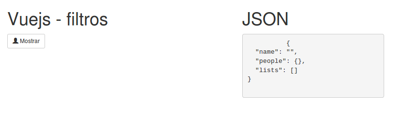
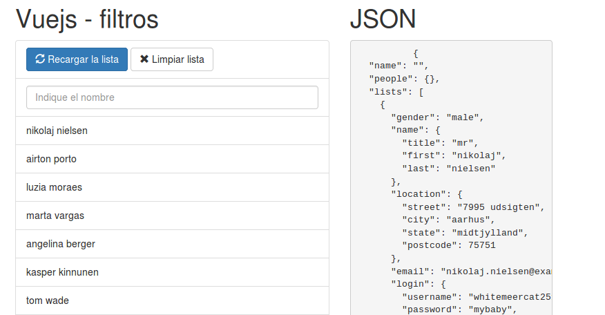
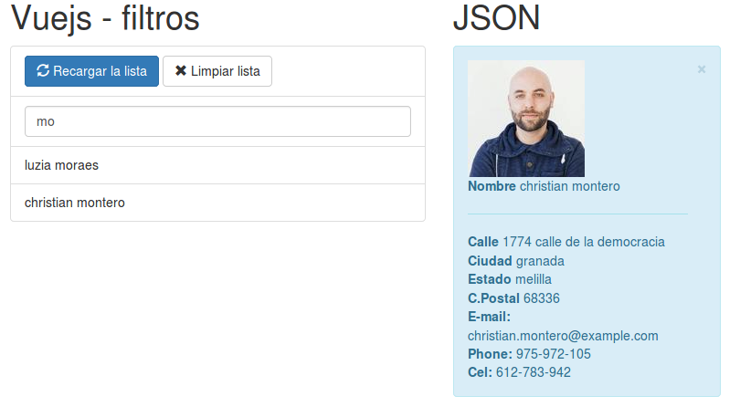

# Vue y Ajax

<h1 align="center">Conecion a api-rest</h1>


Sencillos ejemplos con VueJs y Ajax, usando la librerias vue-resource y axios
Se recomiendo axios, ya que la comunidad la mantiene actualizada


``` bash
  indexfiltros.html
```
<p align="center">
    
</p>
filtro sin cargar o vacio

<p align="center">
    
</p>
filtro con datos

<p align="center">
    
</p>
filtro mostrando datos, con un click en la lista

## Que hace
Es algo muy simple, en un archivo html se llena dinamicante una lista mediante un api-rest, se puede filtrar la lista mediante un texbox y al hacer click en la lista, muestra una tarjeta con la persona. - la verdad es muy simple.

Listo nada del otro mundo, todo se hace con vueJs